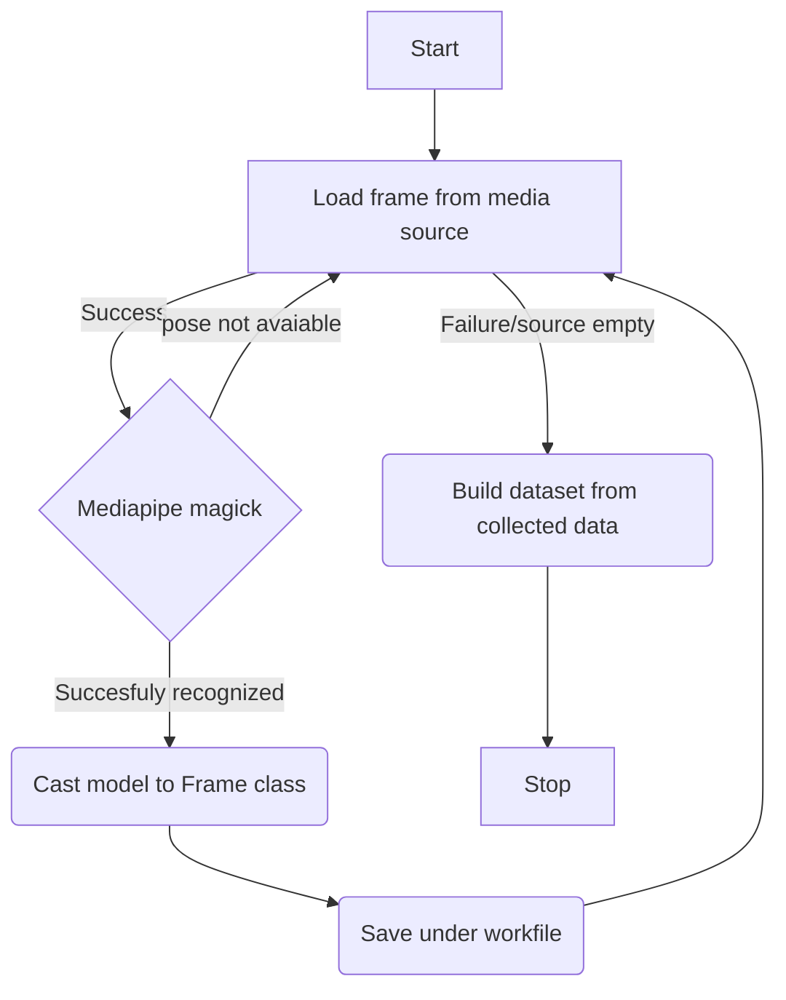

# psw-proj


This application allows user to build datasets based on a defined model. The program utilizes the Mediapipe module provided by Google. Created UI to facilitate accessibility. The program locates the landmarks in the loaded media file, indexes the following frames, and saves the landmark attributes to the LOG* file. During model recognition, loaded media is also modified with a watermark containing the frame index of the media. Modified media is saved under the VID* file. Currently, the program supports the JSON and CSV outputfiles. 

By default, program initializes the "pose" model provided by the Mediapipe module.


## Available data formats

The program utilizes one of the media sources:
- Cam – The application tries to establish communication with the default camera device connected to the PC,
-	Image – user-selected image path is loaded, supported formats: *.png *.jpg *.jpeg *.gif
-	Video - user-selected video path is loaded, supported formats: *.mp4 *.flv *.ts *.mts *.avi *.mov


## Program flow

Before running the program user must choose which media source and output file type the user would like to receive. The recognition program starts after the user clicks the "start" button. The frame is being loaded from the source path with the use of the OpenCV module. A defined mediapipe model extracts the landmarks if are available on the frame. In addition, data is cast on Frame Class to properly parse the collected data at the end of the session. Input frame is modified - marked with frame index and landmark points - and saved under the VID* file. The collected frame is saved under the txt file in the WORKFILES directory. 

If a source is empty or program loses the connection with the camera, the recognition process ends. All of the collected is loaded and properly parsed to the desired output file type, under the LOG* file located in the OUTPUT directory.

Interrupted program's WORKFILES data, whose parsing process isn't finished, can be loaded and parsed with the use of the "load work-file" button.




## Output data 
The user can choose the desired file type of the output data. Files are saved under the OUTPUT directory. All of the output files are signed with the session - Datetime of the start button 
click. LOG files contain data about all of the 33 landmarks occurring on the loaded media. Each frame contains data about the coordinates of occurrence, visibility, index, and the name of the landmark. If a landmark is not visible, the Mediapipe module helps to estimate the position of the landmark. Coordinates of landmark occurrence are bound to the frame resolution.


| JSON FILE                                                                                               |CSV FILE                  |
|-----------------------------------------------------------------------------------------------------|-------------------------------|       
|  ||


## File Structure
Main.py contains the main core of the program with the Mediapipe model and main frame collecting and recognition functions. The window class is defined in interface.py. It contains all the UI elements and button click handling. To properly parse all of the collected data, the Frame class was defined in Frame_class.py. It contains data about the landmarks with coordinates and visibility info on the input image. The OUTPUT folder contains all the output files. All the LOG data and modified input videos are saved here. Inside the WORKFIELS folder are debug txt files, filled with Frame data without loading the whole file and optimizing the program load.


```
|-- OUTPUT
|   |
|   |- WORKFILES
|      |- *.txt
|   |- LOG*.(json/csv)
|   |- VID*.mp4
|
|- main.py
|- interface.py
|- Frame_class.py
|- requirements.txt
|- JSON_TEMPLATE.json
|- README.md
```

## Requirements and Extras
- The requiremets.txt file contains all of the Python modules required to run this application. The project was written in version 3.11.6 of Python with the use of modules:
  - PyQt5 
  - OpenCV
  - Mediapipe
  > Warning! A problem with the installation of Mediapipe with Python 3.12 occurred, due to library errors.
- The JSON_TEMPLATE.json file is required for building the JSON database 

### Extras 
Complete landmark table provided by Mediapipe documentation

| INDEX          |LANDMARK NAME                  |
|----------------|-------------------------------|       
|0               | `"nose"`                      |
|1               | `"left eye (inner)"`          |
|2               | `"left eye"`                  |
|3               | `"left eye (outer)"`          |
|4               | `"right eye (inner)"`         |
|5               | `"right eye"`                 |
|6               | `"right eye (outer)"`         |
|7               | `"left ear"`                  |
|8               | `"right ear"`                 |
|9               | `"mouth (left)"`              |
|10              | `"mouth (right)"`             |
|11              | `"left shoulder"`             |
|12              | `"right shoulder"`            |
|13              | `"left elbow"`                |
|14              | `"right elbow"`               |
|15              | `"left wrist"`                |
|16              | `"right wrist"`               |
|17              | `"left pinky"`                |
|18              | `"right pinky"`               |
|19              | `"left index"`                |
|20              | `"right index"`               |
|21              | `"left thumb"`                |
|22              | `"right thumb"`               |
|23              | `"left hip"`                  |
|24              | `"right hip"`                 |
|25              | `"left knee"`                 |
|26              | `"right knee"`                |
|27              | `"left ankle"`                |
|28              | `"right ankle"`               |
|29              | `"left heel"`                 |
|30              | `"right heel"`                |
|31              | `"left foot index"`           |
|32              | `"right foot index"`          |

